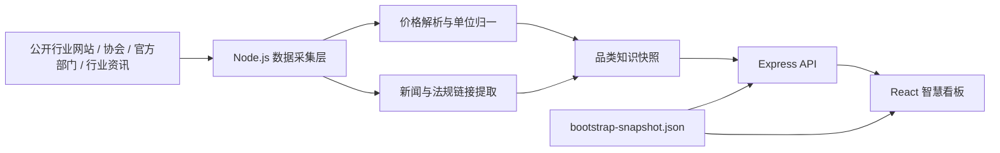

<p align="center">
  
</p>

# 再生资源智慧看板

**Smart Recycling Intelligence Dashboard**

一个面向再生资源行业的实时知识与行情看板，聚合回收价格、行业资讯、法规标准、技术流程、区域热度与趋势分析，帮助使用者快速理解不同再生资源板块的价格波动、市场结构和政策环境。

项目由 **人工智能观星策划，摘星制作**。

## 项目定位

再生资源行业的信息高度分散：价格散落在行业门户、协会网站、企业调价通知、地方市场报价和新闻资讯中；法规标准又分布在生态环境、工信、商务、住建、卫健等多个官方体系内。

本项目的目标不是做一个普通资讯页，而是做一个可以长期迭代的 **再生资源行业智能信息中枢**：

- 对价格：按品类、地区、来源、时间进行结构化展示。
- 对资讯：区分全局行业新闻与品类相关新闻。
- 对法规：区分共性法规、品类专属法规和官方最新动态。
- 对工艺：用流程化方式说明回收、分选、预处理、资源化利用路径。
- 对趋势：用曲线、分布、区域热力和结构分析辅助判断市场变化。

## 核心能力

| 能力模块 | 说明 |
| --- | --- |
| 实时报价监测 | 后端按周期采集公开来源数据，前端定时刷新，报价统一归一到 `元/吨` 口径。 |
| 品类知识库 | 覆盖 18 个再生资源大类，每类包含细分品类、价格结构、痛点、流程和法规。 |
| 新闻分层 | 全局新闻展示行业层面信息，品类新闻展示单一板块的市场异动。 |
| 法规标准 | 共性法规前置，品类专属法规分层展示，并保留官方动态入口。 |
| 技术流程 | 用流程节点表达回收、预处理、分选、处置和再利用路径。 |
| 地图热力 | 使用中国地图表达不同区域报价与资讯覆盖度。 |
| 快照兜底 | 当第三方网站临时不可用或抓取失败时，自动切换到最近可用数据快照，避免页面空白。 |
| 本地一键启动 | 提供 Windows 一键启动脚本，适合个人电脑长期查看。 |

## 覆盖品类

当前覆盖 18 个板块：

`废钢`、`废铜`、`废铝`、`废塑料`、`废纸`、`废玻璃`、`动力电池`、`报废汽车`、`电子废弃物`、`废旧纺织品`、`废橡胶`、`废木材`、`厨余/油脂`、`工业废渣`、`危险废弃物`、`医疗废弃物`、`生活垃圾`、`建筑废弃物`。

每个板块都包含：

- 回收价 Top 条目
- 细分品类标签
- 成本架构
- 技术流程
- 行业痛点
- 共性法规
- 品类专属法规
- 官方动态和标准资料
- 国内/国际资讯
- 区域报价分布
- 历史趋势参考

## 数据架构



## 数据说明

本项目采用 **公开网页采集 + 本地知识配置 + 快照兜底** 的方式组织数据。

- 价格数据优先从行业公开页面中抽取含价格的报价内容。
- 报价统一过滤为回收价格口径，并尽量排除“上调/下调幅度”这类非真实价格。
- 金额单位统一转换为 `元/吨`，不适合按吨计价的条目会被过滤。
- 法规标准以公开官方链接和行业监管口径为基础维护。
- 由于第三方网站没有统一 API，数据实时性受目标网站更新频率、访问限制和页面结构变化影响。
- 生产环境如用于经营决策，建议接入授权行情 API 或自有数据源。

## 技术栈

| 层级 | 技术 |
| --- | --- |
| 前端 | React 19、Vite、TypeScript、Framer Motion、Recharts、D3 Geo |
| 后端 | Node.js、Express、TypeScript、Axios |
| 数据处理 | 网页文本化、价格正则解析、单位归一、快照缓存 |
| 部署 | Render / Railway / 轻量服务器 / 本地 Windows |

## 本地运行

安装依赖：

```bash
npm install
```

启动前端和后端：

```bash
npm run dev
```

访问：

```text
http://localhost:5173/
```

Windows 用户也可以直接运行：

```text
start-dashboard.cmd
```

## 生产部署

### Render / Railway / 云服务器

适合需要实时刷新的部署方式。

```bash
npm install
npm run build
npm start
```

后端默认端口：

```text
8787
```

平台可通过环境变量指定：

```text
PORT=10000
NODE_VERSION=22
```

### Netlify

Netlify 适合静态展示，但不适合长期运行实时采集后端。当前项目保留 Netlify 配置，主要用于静态兜底展示。

## 目录结构

```text
.
├── public/
│   ├── bootstrap-snapshot.json   # 最近可用数据快照
│   ├── china.geo.json            # 中国地图数据
│   └── logo / favicon / app icon
├── server/
│   ├── index.ts                  # API 服务入口
│   ├── recycling-store.ts         # 数据采集、解析、快照生成
│   ├── recycling-config.ts        # 品类、法规、流程、痛点配置
│   └── types.ts
├── src/
│   ├── App.tsx                   # 看板主界面
│   ├── useRecyclingDashboard.ts   # 前端数据加载与兜底逻辑
│   └── types.ts
├── docs/
│   └── repo-cover.svg             # GitHub 仓库封面
├── render.yaml
├── netlify.toml
└── start-dashboard.cmd
```

## 项目边界

这个项目适合：

- 行业行情观察
- 再生资源知识库建设
- 市场波动监控
- 品类研究
- 内部经营看板原型
- 数据源接入前的产品验证

这个项目不直接承诺：

- 交易级实时行情
- 付费平台深度数据替代
- 对第三方网页结构变化的永久兼容
- 未授权数据的商业再分发

## 后续可扩展方向

- 接入授权行情 API。
- 增加企业自有成交价和采购价录入。
- 增加价格预警、涨跌提醒和微信通知。
- 增加账号体系和收藏板块。
- 增加服务器定时任务和持久化数据库。
- 增加移动端独立布局。

## License

Private project. All rights reserved.
