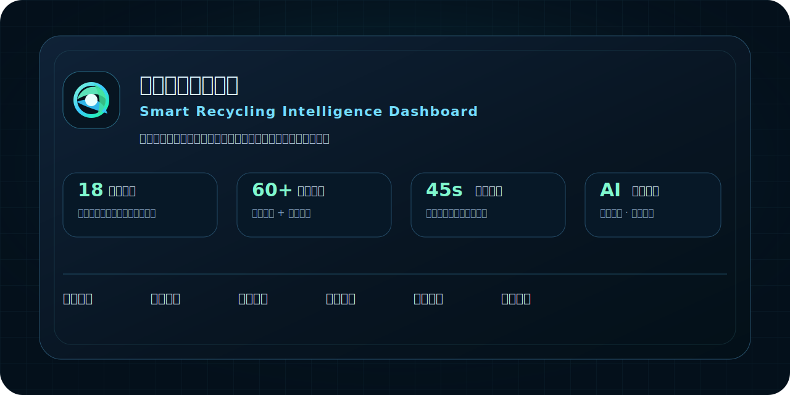
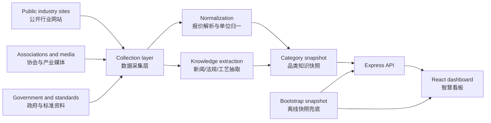

<p align="center">
  
</p>

# 再生资源智慧看板 / Smart Recycling Intelligence Dashboard

**中文**：一个面向再生资源行业的行情、资讯、法规、工艺与趋势智能中枢。它把分散在行业网站、协会资讯、政策文件和公开市场报价中的信息，整理为可持续更新、可对比、可追踪的专业看板。

**English**: An intelligence dashboard for the recycling and secondary-resource market. It consolidates fragmented public market prices, industry news, policy documents, process knowledge, and regional signals into a structured, continuously refreshable decision interface.

> 由 **人工智能观星策划，摘星制作**。  
> Planned by **AI Stargazer** and crafted by **Zhaixing**.

---

## 项目定位 / Positioning

再生资源行业的信息来源高度分散：价格来自行业门户、企业调价通知、地方市场和回收端报价；资讯来自协会、产业媒体和国际机构；法规标准又分布在生态环境、工信、商务、住建、卫健等不同主管体系中。

本项目把这些信息组织成一个专业化的 **再生资源行业知识与行情驾驶舱**，重点不是“展示网页”，而是建立一套可迭代的数据认知框架：先看报价，再看区域，再看新闻，再看法规与工艺，最后形成对品类趋势和行业结构的判断。

The project is designed as an industry-grade intelligence cockpit rather than a static information page. It follows an analyst workflow: monitor prices, compare regions, read signals, verify regulations, understand process constraints, and interpret market trends by category.

## 核心价值 / Core Value

| 维度 / Dimension | 中文说明 | English |
| --- | --- | --- |
| 行情优先 | 回收价是第一层信息，按品类、区域、来源、时间统一展示，并尽量归一到 `元/吨`。 | Prices are the primary layer, normalized by category, region, source, time, and where applicable into RMB per ton. |
| 知识分层 | 全局行业新闻、品类新闻、法规标准、工艺流程、行业痛点分层展示，减少信息混杂。 | News, category signals, regulations, process flows, and pain points are separated into clear layers. |
| 品类完整 | 覆盖金属、塑料、纸、玻璃、电池、车辆、电子废弃物、危废、医废等 18 个板块。 | Covers 18 recycling sectors, from metals and plastics to batteries, vehicles, e-waste, hazardous waste, and medical waste. |
| 近实时更新 | 后端周期性抓取公开来源，前端轮询刷新；抓取失败时使用最近快照兜底，避免页面空白。 | The backend polls public sources periodically, while the frontend refreshes continuously with snapshot fallback. |
| 专业可扩展 | 数据结构按“品类 - 细分品类 - 报价 - 新闻 - 法规 - 工艺 - 趋势”建模，便于后续扩展。 | The schema is built around category, subcategory, quotes, news, regulations, process, and analytics for long-term expansion. |

## 覆盖品类 / Category Coverage

`废钢`、`废铜`、`废铝`、`废塑料`、`废纸`、`废玻璃`、`动力电池`、`报废汽车`、`电子废弃物`、`废旧纺织品`、`废橡胶`、`废木材`、`厨余/油脂`、`工业废渣`、`危险废弃物`、`医疗废弃物`、`生活垃圾`、`建筑废弃物`。

Steel scrap, copper scrap, aluminum scrap, recycled plastics, waste paper, waste glass, power batteries, end-of-life vehicles, e-waste, waste textiles, waste rubber, waste wood, kitchen waste and grease, industrial slag, hazardous waste, medical waste, municipal waste, and construction waste.

每个板块默认包含以下分析层：

- 回收价 Top 条目 / Top recycling price records
- 细分品类标签 / Subcategory taxonomy
- 成本架构 / Cost structure
- 技术流程 / Technical process flow
- 行业痛点 / Industry pain points
- 共性法规 / Common regulatory layer
- 品类专属法规 / Category-specific regulation layer
- 官方动态与标准资料 / Official updates and standards references
- 国内与国际资讯 / Domestic and international news
- 区域分布与趋势参考 / Regional distribution and trend reference

## 信息架构 / Intelligence Architecture



## 数据策略 / Data Policy

本项目采用 **公开网页采集 + 本地知识配置 + 快照兜底** 的组合方式。它适合用于行业观察、个人研究、行情跟踪和知识整理，不等同于交易所级别的低延迟行情系统。

The system combines public-source crawling, curated local knowledge, and snapshot fallback. It is designed for market observation, research, and industry intelligence, not exchange-grade low-latency trading.

- 报价优先抓取含真实金额的回收价内容，尽量排除“上涨 20 元/吨”“下调 30 元/吨”这类调价幅度。
- 单位优先统一为 `元/吨`；不适合吨计价的品类，会在数据层保留原始描述并标注来源。
- 新闻按全局行业新闻与品类相关新闻拆分，避免所有内容混在同一列表中。
- 法规标准分为共性法规、品类专属法规和官方最新动态三层。
- 第三方网站不可用、限流或页面变化时，系统保留最近可用快照，保证看板可读。

## 设计方向 / Design Direction

视觉目标是“专业行情终端 + 产业研究杂志”：深色玻璃质感、清晰卡片层级、强数据密度、克制的发光效果、顺滑但不过度的交互。界面优先服务快速判断，而不是装饰性堆叠。

The visual language combines a professional market terminal with an editorial intelligence magazine: dark glass panels, crisp hierarchy, high data density, controlled glow, and smooth interactions that support rapid interpretation.

## 技术栈 / Technology Stack

| Layer | Technology |
| --- | --- |
| Frontend | React, TypeScript, Vite, Recharts, D3 Geo, Framer Motion |
| Backend | Node.js, Express, TypeScript, Cheerio, Axios, fast-xml-parser |
| Data | Public web extraction, curated category config, bootstrap snapshot fallback |
| Delivery | Local Windows launcher, Railway/Node deployment compatible |

## 本地运行 / Local Development

```bash
npm install
npm run dev
```

默认地址：

- 前端 / Frontend: `http://localhost:5173/`
- 后端 / API: `http://localhost:8787/api/health`

Windows 用户也可以双击项目根目录中的 `start-dashboard.cmd` 一键启动。

Windows users can launch the dashboard directly with `start-dashboard.cmd` in the project root.

## 生产部署 / Production Deployment

```bash
npm run build
npm run start
```

The server serves both the API and the built frontend. It is compatible with common Node.js hosting services such as Railway, Render, and lightweight cloud servers.

## 项目边界 / Scope

- 本项目只采集和整理公开可访问的信息，不绕过登录、付费墙或反爬限制。
- 本项目不提供投资、交易或采购决策承诺，数据需要结合原始来源复核。
- 如果未来接入付费数据源或官方 API，应优先走授权接口，而不是非授权抓取。

## Roadmap

- 增强每个品类的历史曲线样本和区域对比。
- 增加可配置的数据源权重与可信度评分。
- 增加法规标准的更新时间监控和失效提示。
- 增加移动端快捷入口和家庭局域网访问方案。
- 增加按品类导出的行业快报与日报能力。

## License

Private project. All third-party data belongs to its original source. Use responsibly and verify important decisions against source materials.
